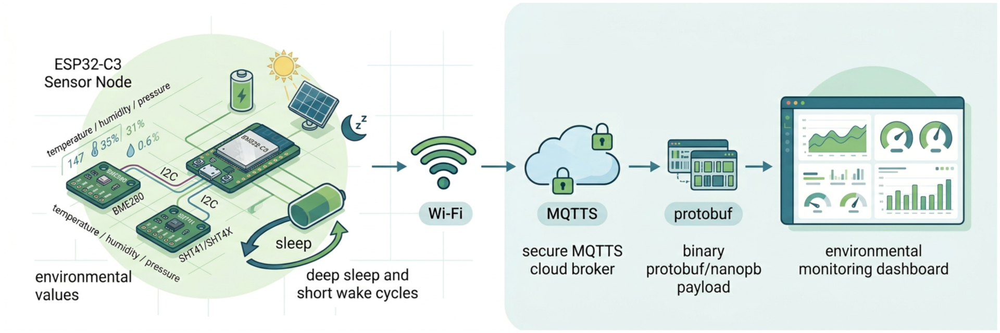

# 🌱 esp32-envsensor-mqtt

[https://github.com/pvamos/esp32-envsensor-mqtt](https://github.com/pvamos/esp32-envsensor-mqtt)

ESP-IDF firmware for an **ESP32-C3** environmental sensor node measuring air temperature, pressure and humidity.

The device wakes periodically, reads local Bosch BME280 and Sensirion SHT40 I2C environmental sensors,
encodes a binary **Protocol Buffers** message with **nanopb**,
publishes it to an MQTT broker over **MQTTS**, then returns to deep sleep.



The current code is optimized for a one-shot low-power cycle:

```text
wake/reset
  ├─ optional first-boot random jitter
  ├─ start Wi-Fi station connection asynchronously
  ├─ read ESP32-C3 internal die temperature
  ├─ initialize I2C and enabled external sensors
  ├─ read BME280 and/or SHT4X measurements
  ├─ wait for Wi-Fi IPv4 readiness
  ├─ encode envsensor.Reading with nanopb
  ├─ MQTT connect → publish once → disconnect
  ├─ update RTC-backed failure/backoff state
  └─ deep sleep until next cadence point
```

> **Public repository note:** this firmware contains configuration values that are private in real deployments:
> Wi-Fi credentials, MQTT credentials, MQTT topic/site identifiers, broker hostnames, and device/location identifiers.
> Keep only placeholders in the public repository.
> See [Sensitive configuration and public-release checklist](https://github.com/pvamos/esp32-envsensor-mqtt/tree/main#-sensitive-configuration-and-public-release-checklist).

---

## 👨‍🔬 Author

**Péter Vámos**

* [https://github.com/pvamos](https://github.com/pvamos)
* [https://linkedin.com/in/pvamos](https://linkedin.com/in/pvamos)
* [pvamos@gmail.com](mailto:pvamos@gmail.com)

---

## 🎓 Academic context

This project was created for, and is part of, the author's **2026 thesis project**
for the **Expert in Applied Environmental Studies BSc** program at **John Wesley Theological College, Budapest**.

## 📜 Current behavior

- Target: **ESP32-C3 only**. `main/main.c` intentionally fails the build for non-ESP32-C3 targets.
- Main board/pin configuration currently matches an ESP32-C3 board using:
  - I2C SDA: **GPIO 8**
  - I2C SCL: **GPIO 9**
  - I2C frequency: **100 kHz**
- External sensors currently implemented:
  - **BME280** at I2C address `0x77`: temperature, pressure, humidity
  - **SHT4X/SHT41** at I2C address `0x44`: temperature, humidity
- Internal sensor:
  - ESP32-C3 internal die temperature via ESP-IDF `temperature_sensor` driver
- Network:
  - Wi-Fi station mode
  - RTC-memory fast reconnect using cached BSSID/channel
  - targeted scan fallback if fast connect fails
  - IPv4 readiness is based on `IP_EVENT_STA_GOT_IP`
- MQTT:
  - MQTTS broker URI
  - username/password authentication
  - QoS 1 publish
  - retain flag disabled
  - connect/publish/disconnect on each wake
  - one full retry if the first MQTT publish attempt fails
  - TLS certificate verification is intentionally disabled by default to minimize network/provisioning overhead, reduce active time and power consumption, and optimize battery life
- Power/cadence:
  - normal cadence: **30 seconds** measured from cycle start
  - active time is subtracted from the sleep period
  - minimum safety sleep: **1 second**
  - first cold boot random jitter: **0–15 seconds**
  - after **6 consecutive Wi-Fi/MQTT failures**, the device enters a **15-minute backoff** cadence until a successful publish resets the failure state

---

## 📁 Repository layout

```text
.
├── CMakeLists.txt
├── main/
│   ├── main.c
│   ├── CMakeLists.txt
│   └── sensors_enable.h.in
├── components/
│   ├── bme280/             # BME280 forced-mode driver
│   ├── envsensor_proto/    # envsensor.proto + generated nanopb C sources
│   ├── esp_temp/           # ESP32-C3 internal temperature wrapper
│   ├── i2c/                # ESP-IDF v5 I2C master wrapper
│   ├── mqtt_push/          # protobuf encoding + one-shot MQTT publish
│   ├── nanopb/             # nanopb runtime, with vendor/nanopb as a submodule
│   ├── sht4x/              # SHT4X/SHT41 high-precision measurement driver
│   └── wifi_sta/           # Wi-Fi station connect, RTC fast reconnect, status API
├── COPYRIGHT_NOTICE
├── LICENSE
├── LICENSE_BME280
├── LICENSE_ESP-IDF
├── LICENSE_TMP117
└── README.md
```

---

## 🧰 Prerequisites

### ESP-IDF

This project was prepared for **ESP-IDF 5.5.x** and tested against an ESP32-C3 configuration.

Example setup using ESP-IDF v5.5.1:

```bash
mkdir -p ~/esp
cd ~/esp
git clone -b v5.5.1 --recursive https://github.com/espressif/esp-idf.git
cd esp-idf
./install.sh esp32c3
source ./export.sh
```

In each new shell:

```bash
source ~/esp/esp-idf/export.sh
```

### Host packages

Fedora example:

```bash
sudo dnf install -y \
  git cmake ninja-build flex bison gperf \
  python3 python3-pip python3-setuptools \
  dfu-util libusb1-devel protobuf-compiler
```

Serial permission example:

```bash
sudo usermod -aG dialout "$USER"
# log out and back in before flashing
```

---

## 📦 Clone with submodules

Nanopb is included as a git submodule under `components/nanopb/vendor/nanopb`.

```bash
git clone --recurse-submodules <REPOSITORY_URL> esp32-envsensor-mqtt
cd esp32-envsensor-mqtt
```

If already cloned without submodules:

```bash
git submodule update --init --recursive
```

---

## 🚀 Build

Set the ESP32-C3 target once for the build directory:

```bash
idf.py set-target esp32c3
```

Build:

```bash
idf.py build
```

Clean rebuild:

```bash
idf.py fullclean
idf.py build
```

Flash and monitor:

```bash
idf.py -p /dev/ttyUSB0 flash monitor
```

Useful monitor shortcuts:

- `Ctrl+]` exits the monitor
- `Ctrl+T Ctrl+R` resets the chip
- `Ctrl+T Ctrl+H` shows monitor help

---

## 🔧 Sensor build switches

`main/CMakeLists.txt` exposes CMake options that decide whether external sensor components are built and linked:

| Option | Default | Effect |
|---|---:|---|
| `ENVSENSOR_USE_BME280` | `ON` | Enables BME280 code and protobuf population |
| `ENVSENSOR_USE_SHT4X` | `ON` | Enables SHT4X/SHT41 code and protobuf population |

The generated header is created from `main/sensors_enable.h.in` into the build directory.

Example: build without BME280:

```bash
idf.py fullclean
idf.py -DENVSENSOR_USE_BME280=OFF build
```

Example: build without SHT4X:

```bash
idf.py fullclean
idf.py -DENVSENSOR_USE_SHT4X=OFF build
```

Example: build without either external sensor, keeping only ESP32-C3 internal die temperature, Wi-Fi RSSI and metadata:

```bash
idf.py fullclean
idf.py -DENVSENSOR_USE_BME280=OFF -DENVSENSOR_USE_SHT4X=OFF build
```

`main/sensors_enable.h` should **not** be committed. It is generated by CMake. If it appears in the source tree, remove it and rebuild:

```bash
rm -f main/sensors_enable.h
idf.py fullclean
idf.py build
```

---

## 🔌 Hardware wiring

Current I2C defaults are defined in `components/i2c/i2c.h`:

```c
#define I2C_MASTER_SCL_IO 9
#define I2C_MASTER_SDA_IO 8
#define I2C_MASTER_FREQ_HZ 100000
```

The comments in that file also document alternative board pinouts,
for example SparkFun ESP32-C3 Pro Micro Qwiic and ESP32 WROOM Thing Plus wiring. Adjust the defines to match your board.

Typical sensor addresses used by this firmware:

| Sensor | Address | Notes |
|---|---:|---|
| BME280 | `0x77` | Many breakout boards can also use `0x76`; change `BME280_I2C_ADDR` if needed. |
| SHT4X/SHT41 | `0x44` | Default Sensirion SHT4X address. |

---

## 📡 MQTT payload

Payloads are binary protobuf messages encoded with nanopb using `components/envsensor_proto/envsensor.proto`.

Current schema:

```proto
syntax = "proto3";
package envsensor;

message BME280 { float t = 1; float p = 2; float h = 3; }
message SHT4X  { float t = 1; float h = 2; }

message Reading {
  fixed64 mac   = 1;
  sint32 rssi   = 2;
  uint32 batt   = 3;
  float esp32_t = 4;

  optional BME280 bme280 = 5;
  optional SHT4X  sht4x  = 6;
}
```

Field notes:

| Field | Meaning |
|---|---|
| `mac` | ESP32 Wi-Fi STA MAC address packed into the lower 48 bits of a `fixed64`. Treat it as a device identifier. |
| `rssi` | Wi-Fi RSSI in dBm. |
| `batt` | Placeholder, currently encoded as `0`. Battery measurement is not implemented yet. |
| `esp32_t` | ESP32-C3 internal die temperature in °C. This is not ambient temperature. |
| `bme280` | Present only when at least one BME280 value was successfully read. |
| `sht4x` | Present only when at least one SHT4X value was successfully read. |

Nanopb presence note: optional submessages require setting `has_bme280` and/or `has_sht4x` before encoding.
The current `mqtt_push` component does this automatically when values are not `NAN`.

---

## 🧬 Regenerate nanopb files

Generated files are committed next to the schema:

- `components/envsensor_proto/envsensor.pb.c`
- `components/envsensor_proto/envsensor.pb.h`

Regenerate them after editing `envsensor.proto`:

```bash
export NANOPB_GEN="$PWD/components/nanopb/vendor/nanopb/generator"
export PATH="$NANOPB_GEN:$PATH"

protoc \
  -I"$PWD/components/envsensor_proto" \
  -I"$NANOPB_GEN/proto" \
  --nanopb_out="$PWD/components/envsensor_proto" \
  "$PWD/components/envsensor_proto/envsensor.proto"
```

If `protoc-gen-nanopb` is not found, verify the submodule:

```bash
git submodule update --init --recursive
ls -l components/nanopb/vendor/nanopb/generator/protoc-gen-nanopb
```

---

## 🔐 Wi-Fi and MQTT configuration

The current implementation uses compile-time constants.

### 📶 Wi-Fi

`components/wifi_sta/wifi_sta.c` currently expects these macros:

```c
#define CONFIG_WIFI_SSID     "example-ssid"
#define CONFIG_WIFI_PASSWORD "example-password"
```

### 📡 MQTT

`components/mqtt_push/mqtt_push.c` currently uses these macros:

```c
#define MQTT_BROKER_URI "mqtts://mqtt.example.com:8883"
#define MQTT_TOPIC      "envsensor/site/device-001"
#define MQTT_USERNAME   "example-user"
#define MQTT_PASSWORD   "example-password"
```

TLS server certificate verification is intentionally disabled by default in the current low-power firmware:

```c
static const bool MQTT_TLS_VERIFY_CERT = false;
```

This is a battery-oriented trade-off: the node wakes, publishes one small message, and returns to deep sleep.
Skipping broker certificate verification avoids CA bundle validation and related setup overhead, reduces active time,
and helps optimize battery life. It can be enabled again if stronger broker authentication is required;
see [TLS certificate verification](#tls-certificate-verification).

For a public repository, the committed defaults should be harmless placeholders only.
Keep real values in local-only files, local patches, private branches, CI secrets, NVS provisioning, or Kconfig/menuconfig integration.

---

## 🛡 Sensitive configuration and public-release checklist

Before making this repository public, remove or mask the following classes of information from the working tree **and from git history**.

| Information | Current location | Why mask it | Public placeholder example |
|---|---|---|---|
| Wi-Fi SSID | `components/wifi_sta/wifi_sta.c` | Identifies your local network and sometimes the ISP/router. | `example-ssid` |
| Wi-Fi password | `components/wifi_sta/wifi_sta.c` | Grants access to your network. | `example-password` |
| MQTT broker URI/hostname | `components/mqtt_push/mqtt_push.c` | Can expose private infrastructure. | `mqtts://mqtt.example.com:8883` |
| MQTT username | `components/mqtt_push/mqtt_push.c` | Account identifier for broker authentication. | `example-user` |
| MQTT password | `components/mqtt_push/mqtt_push.c` | Grants broker access. | `example-password` |
| MQTT topic | `components/mqtt_push/mqtt_push.c` | May reveal project names, customer/site names, addresses, location, or device numbering. | `envsensor/<site>/<device-id>` |
| Device/site/location identifiers | MQTT topic strings, examples, logs, documentation | Can reveal where sensors are deployed. | `<site-id>`, `<device-id>` |
| Device MAC, AP BSSID, local IP/gateway/DNS | Serial logs or pasted troubleshooting output | Identifies your device/network topology. | `<mac>`, `<bssid>`, `<ip>` |
| Personal email/profile URLs | `LICENSE`, README, comments | Not a secret if intentionally public, but review before publishing. | project-maintainer contact or omitted |
| Generated build/cache logs | `build/`, nested `*/build/`, `CMakeFiles/`, `log/` | May contain host usernames, absolute paths, toolchain paths, and failed command output. | remove from repository |

### 🧪 Example: public placeholders in source

The public repository should contain placeholder values only:

```c
#define CONFIG_WIFI_SSID     "example-ssid"
#define CONFIG_WIFI_PASSWORD "example-password"

#define MQTT_BROKER_URI "mqtts://mqtt.example.com:8883"
#define MQTT_TOPIC      "envsensor/example-site/example-device"
#define MQTT_USERNAME   "example-user"
#define MQTT_PASSWORD   "example-password"
```

### 🧩 Example: local private configuration header pattern

One practical way to keep the public source clean is to add support for an ignored private header.

Create a local-only file named `private_config.h` and keep it out of git:

```c
#pragma once

#define CONFIG_WIFI_SSID     "your-real-wifi-ssid"
#define CONFIG_WIFI_PASSWORD "your-real-wifi-password"

#define MQTT_BROKER_URI "mqtts://your-broker.example:8883"
#define MQTT_TOPIC      "envsensor/your-site/your-device-id"
#define MQTT_USERNAME   "your-mqtt-username"
#define MQTT_PASSWORD   "your-mqtt-password"

// Set to 1 to enable broker certificate verification.
#define MQTT_TLS_VERIFY_CERT 0
```

Then adapt `wifi_sta.c` and `mqtt_push.c` to include it if present, while keeping safe public defaults:

```c
#if __has_include("private_config.h")
#include "private_config.h"
#endif

#ifndef CONFIG_WIFI_SSID
#define CONFIG_WIFI_SSID     "example-ssid"
#define CONFIG_WIFI_PASSWORD "example-password"
#endif

#ifndef MQTT_BROKER_URI
#define MQTT_BROKER_URI "mqtts://mqtt.example.com:8883"
#define MQTT_TOPIC      "envsensor/example-site/example-device"
#define MQTT_USERNAME   "example-user"
#define MQTT_PASSWORD   "example-password"
#endif

#ifndef MQTT_TLS_VERIFY_CERT
#define MQTT_TLS_VERIFY_CERT 0
#endif
```

For a more polished long-term solution, move these values into ESP-IDF Kconfig options, NVS provisioning,
or a manufacturing/provisioning flow so the same public firmware source can be built for many devices without committing secrets.

---

## 🔒 TLS certificate verification

The project uses `mqtts://` for MQTT over TLS. TLS still provides encryption and integrity for the connection,
but broker certificate verification is intentionally disabled by default in this firmware:

```c
static const bool MQTT_TLS_VERIFY_CERT = false;
```

This is a deliberate low-power design choice. The device is optimized for a short wake cycle: connect to Wi-Fi,
read sensors, publish one small protobuf message, disconnect, and return to deep sleep. Disabling certificate
verification avoids CA bundle validation and certificate-chain handling during the active window. It also avoids
adding supporting mechanisms such as trusted-time synchronization solely for certificate validity checks.
In this deployment model, the goal is to minimize network/provisioning overhead, reduce active time and power
consumption, and optimize battery life.

Security trade-off: with verification disabled, the device does **not** authenticate that it is connected to the
intended MQTT broker. The traffic is still carried over TLS, but an attacker who can intercept or redirect traffic
could impersonate the broker. Use this mode only when that risk is acceptable for the deployment environment.

### ✅ Enable TLS certificate verification

To enable broker certificate verification, change the flag in `components/mqtt_push/mqtt_push.c`:

```c
static const bool MQTT_TLS_VERIFY_CERT = true;
```

The current code already contains the verification branch. When the flag is `true`, it attaches the ESP-IDF
certificate bundle and enables common-name/hostname checking:

```c
if (MQTT_TLS_VERIFY_CERT) {
    mqtt_cfg.broker.verification.crt_bundle_attach = esp_crt_bundle_attach;
    mqtt_cfg.broker.verification.skip_cert_common_name_check = false;
}
```

Make sure the source includes the ESP-IDF certificate bundle header:

```c
#include "esp_crt_bundle.h"
```

Then enable the certificate bundle in ESP-IDF configuration if it is not already enabled:

```bash
idf.py menuconfig
```

In menuconfig, enable the ESP x509 certificate bundle option under the mbedTLS certificate bundle settings.
For public CA-signed brokers, the default bundle is usually sufficient. For a private CA or self-signed broker
certificate, use one of these approaches instead:

- embed only your private CA certificate and assign it through `mqtt_cfg.broker.verification.certificate`
- pin the broker certificate or public key
- keep using the ESP-IDF certificate bundle if your broker certificate chains to a public CA

Certificate validation also requires the device to have a reasonable system time. If validation fails because
the ESP32-C3 wakes without a valid clock, add SNTP or another trusted time source before the MQTT connection.
Be aware that time synchronization itself can increase network traffic and active time.

### 🧩 Using the private configuration header pattern

If you adopt the optional `private_config.h` pattern shown above, control the setting there instead of editing
the public source each time:

```c
// Low-power default used by this project.
#define MQTT_TLS_VERIFY_CERT 0

// To enable broker authentication, change the value to 1:
// #define MQTT_TLS_VERIFY_CERT 1
```

Do not define the symbol twice in the same build. Choose either `0` or `1`.

Safer alternatives for low-power deployments:

- ship only your broker/private CA instead of the full CA bundle
- pin the broker certificate or public key
- reduce the number of TLS handshakes by batching measurements where appropriate
- add SNTP or another trusted time source only if certificate validity checks require it

---

## 🔬 Troubleshooting

### 🧱 Build fails on non-ESP32-C3 target

This is intentional. The current firmware contains:

```c
#if !CONFIG_IDF_TARGET_ESP32C3
#error "This firmware is intended for ESP32-C3 (SparkFun Pro Micro ESP32-C3)."
#endif
```

Use:

```bash
idf.py set-target esp32c3
idf.py fullclean
idf.py build
```

### 📶 Wi-Fi does not become ready

- Confirm the SSID/password are configured correctly.
- Check whether the AP is reachable from the deployment location.
- If fast reconnect cached a stale BSSID/channel, call `wifi_rtc_clear()` during debugging or power-cycle the device.
- Check logs for scan fallback and disconnect reason codes.

### 📡 MQTT connect timeout or publish not confirmed

- Confirm broker hostname, port and credentials.
- Confirm the broker accepts MQTT over TLS on the configured port.
- Confirm the ACL allows publishing to the configured topic.
- If certificate verification is enabled, confirm the device has a valid time source and trusts the broker CA or pinned certificate.

### 🔒 TLS handshake failures

- Confirm the URI starts with `mqtts://`.
- Confirm the port is correct, commonly `8883` for MQTTS.
- For private CAs, include your CA certificate or use an appropriate pinning strategy.
- If verification is disabled intentionally for low-power operation, confirm that this security trade-off is acceptable for the deployment environment.

### 🔌 I2C sensor failures

- Confirm SDA/SCL pins match `components/i2c/i2c.h`.
- Confirm sensor power level and pull-ups.
- Confirm I2C addresses:
  - BME280 may be `0x76` instead of `0x77`.
  - SHT4X/SHT41 is normally `0x44`.
- Check that the relevant CMake sensor option is enabled.

### 🧬 Nanopb submodule missing

```bash
git submodule update --init --recursive
```

---

## 🛣 Roadmap / recommended improvements

- Move Wi-Fi and MQTT configuration to Kconfig, NVS provisioning, or a private header pattern.
- Implement battery voltage measurement and encode `batt` in millivolts.
- Optionally add SNTP or another trusted time source when TLS certificate validation is enabled.
- Optionally generate MQTT topic from a base topic plus the device MAC or a provisioned device ID.
- Add a `sdkconfig.defaults` file for reproducible public builds, without secrets.
- Consider adding CI that builds with all sensor combinations.

---

## ⚖ License

The main project is published under the MIT License, what is also included in `LICENSE`.

See `COPYRIGHT_NOTICE` for license and copyright details and third-party notices.

The repository also includes license files for referenced or reimplemented components:

- `LICENSE_BME280`
- `LICENSE_ESP-IDF`
- `LICENSE_TMP117`

---

MIT License

Copyright (c) 2025 Péter Vámos pvamos@gmail.com https://github.com/pvamos

Permission is hereby granted, free of charge, to any person obtaining a copy
of this software and associated documentation files (the "Software"), to deal
in the Software without restriction, including without limitation the rights
to use, copy, modify, merge, publish, distribute, sublicense, and/or sell
copies of the Software, and to permit persons to whom the Software is
furnished to do so, subject to the following conditions:

The above copyright notice and this permission notice shall be included in all
copies or substantial portions of the Software.

THE SOFTWARE IS PROVIDED "AS IS", WITHOUT WARRANTY OF ANY KIND, EXPRESS OR
IMPLIED, INCLUDING BUT NOT LIMITED TO THE WARRANTIES OF MERCHANTABILITY,
FITNESS FOR A PARTICULAR PURPOSE AND NONINFRINGEMENT. IN NO EVENT SHALL THE
AUTHORS OR COPYRIGHT HOLDERS BE LIABLE FOR ANY CLAIM, DAMAGES OR OTHER
LIABILITY, WHETHER IN AN ACTION OF CONTRACT, TORT OR OTHERWISE, ARISING FROM,
OUT OF OR IN CONNECTION WITH THE SOFTWARE OR THE USE OR OTHER DEALINGS IN THE
SOFTWARE.
